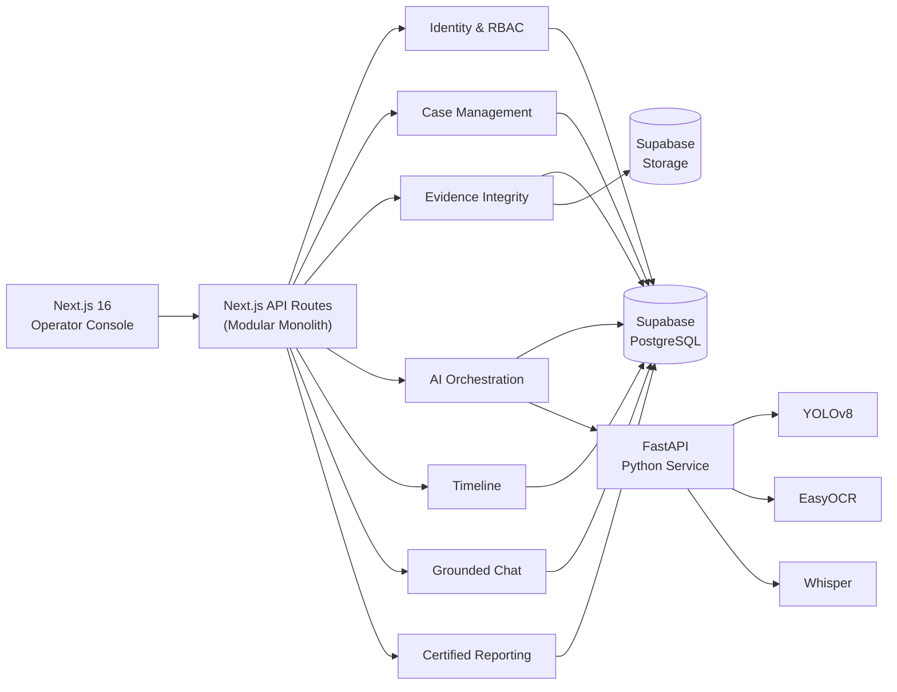
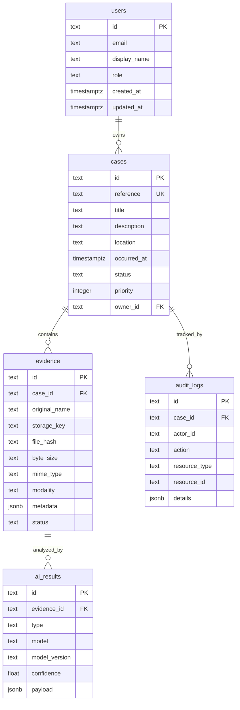
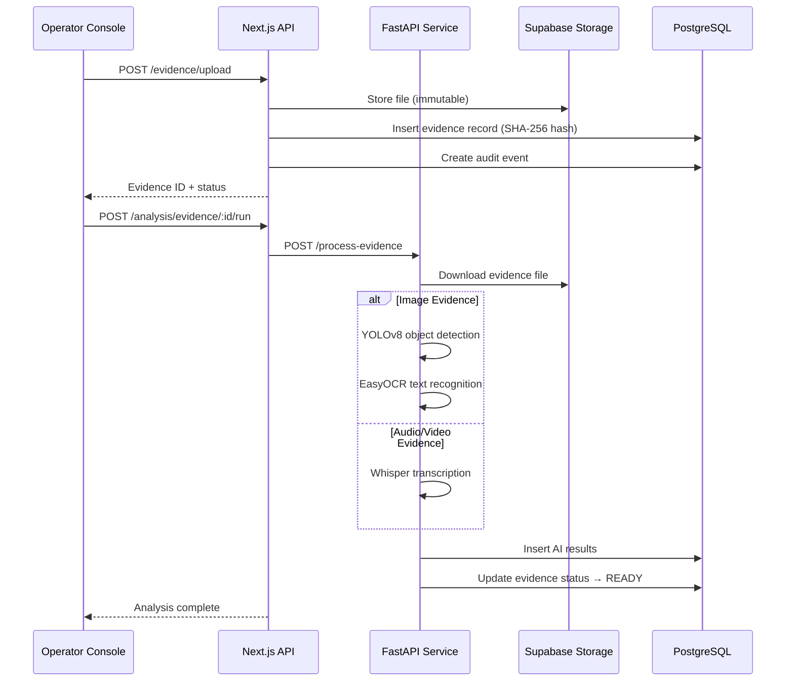

<p align="center">
  
  
  
  
  
  
  
</p>

<h1 align="center">🔍 CrimeVision AI</h1>

<p align="center">
  <strong>AI-Powered Digital Crime Scene Reconstruction & Investigation Platform</strong>
</p>

<p align="center">
  <em>Built by <a href="https://github.com/PranjalGupta-05/Team-VERTEx">Team VERTEx</a> — Transforming digital forensics with computer vision, 3D scene reconstruction, and intelligent evidence analysis.</em>
</p>

---

## 📋 Table of Contents

- [Overview](#-overview)
- [Key Features](#-key-features)
- [Architecture](#-architecture)
- [Tech Stack](#-tech-stack)
- [Project Structure](#-project-structure)
- [Getting Started](#-getting-started)
- [Environment Variables](#-environment-variables)
- [Database Schema](#-database-schema)
- [API Reference](#-api-reference)
- [AI Pipeline](#-ai-pipeline)
- [Screenshots](#-screenshots)
- [Contributing](#-contributing)
- [Important Disclaimer](#%EF%B8%8F-important-disclaimer)
- [Team](#-team)
- [License](#-license)

---

## 🌟 Overview

**CrimeVision AI** is a production-oriented platform for digital evidence ingestion, AI-assisted indexing, interactive 3D crime scene review, grounded investigation workflows, and certified case exports. It combines state-of-the-art computer vision models (YOLOv8, EasyOCR, Whisper) with an immersive Three.js-powered 3D reconstruction engine, all backed by a secure, audit-trail-first architecture.

The platform follows a **modular-monolith** design: business modules share one transactional backend deployment without collapsing their responsibilities into a single service layer. Every evidence mutation, integrity check, query, and export creates an immutable audit event — maintaining a full chain of custody.

---

## ✨ Key Features

### 🎯 Command Center Dashboard
- Real-time case metrics (active cases, evidence items, pending analyses, integrity coverage)
- Priority-sorted case cards with status badges and evidence counts
- One-click case creation with auto-generated reference numbers

### 🗂️ Case Management
- Full case lifecycle: `OPEN` → `PROCESSING` → `REVIEW` → `CLOSED`
- Priority levels (1–5) with visual indicators
- Case-scoped evidence grouping and access control

### 📤 Evidence Ingestion & Integrity
- Multi-format upload support (images, video, audio, documents)
- **SHA-256 hashing** on every upload for tamper detection
- Storage-key-based immutable file addressing
- Integrity recomputation endpoint for verification
- Status tracking: `UPLOADED` → `QUEUED` → `PROCESSING` → `READY` / `FAILED`

### 🤖 AI-Powered Analysis
| Model | Capability | Output |
|-------|-----------|--------|
| **YOLOv8** | Object detection (persons, vehicles, weapons, objects) | Bounding boxes + confidence scores |
| **EasyOCR** | Text recognition (license plates, documents, signs) | Extracted text + probability |
| **Whisper** | Audio/video transcription | Full transcription text |

### 🏗️ 3D Crime Scene Reconstruction
- Interactive **Three.js** point-cloud scene viewer with OrbitControls
- Ballistic trajectory calculation (pitch, yaw, distance, velocity)
- Evidence marker placement with spatial context
- WebGL rendering with canvas fallback
- Fullscreen mode and camera reset controls

### 💬 Evidence-Grounded Chat
- AI-powered Q&A scoped to indexed evidence and AI results
- Citation-backed answers with evidence references
- Explicit refusal of unsupported conclusions

### 📊 Timeline & Audit Trail
- Chronological event reconstruction across all evidence items
- Append-only audit log for complete chain of custody
- Every action recorded: uploads, queries, integrity checks, exports

### 📄 Certified Report Generation
- **Zero-dependency PDF generator** (raw PDF 1.4 spec primitives)
- JSON manifest export with cryptographic binding
- Multi-page reports with case metadata, evidence inventory, AI findings, and audit trail
- Court-ready formatting with integrity verification statements

### 🔐 Authentication & Security
- Animated splash screen with cinematic background
- Multi-form auth flow: login, signup, forgot password, OTP verification
- Social auth integration ready
- Role-based access control: `ADMIN`, `INVESTIGATOR`, `ANALYST`
- Interactive UI elements (magnetic buttons, animated inputs, interactive eye)

### ⚙️ Settings & Help
- Full user profile management
- Application preferences and notification settings
- Built-in help center with documentation

---

## 🏗 Architecture



### Module Responsibilities

| Module | Responsibility | Owns |
|--------|---------------|------|
| **Auth** | Establish actor identity, enforce roles | Request actor context |
| **Cases** | Case lifecycle and access-scoped retrieval | `cases` table |
| **Evidence** | Upload, hashing, storage keys, integrity checks | `evidence` table |
| **Analysis** | Queuing and normalization of inference output | `ai_results` table |
| **Timeline** | Chronological read model over case results | Read-only |
| **Chat** | Evidence-grounded retrieval and answers | Audit event only |
| **Reporting** | Cryptographically bound export manifests | Audit event only |
| **Audit** | Append-only chain-of-custody history | `audit_logs` table |

---

## 🛠 Tech Stack

### Frontend
| Technology | Purpose |
|-----------|---------|
| **Next.js 16** | React framework with App Router, API routes, and SSR |
| **React 19** | UI component library |
| **Three.js 0.179** | 3D crime scene rendering and point-cloud visualization |
| **Framer Motion 12** | Page transitions and micro-animations |
| **Tailwind CSS 3.4** | Utility-first styling with custom forensic dark theme |
| **Lucide React** | Icon system |
| **Zod 4** | Runtime type validation |

### Backend
| Technology | Purpose |
|-----------|---------|
| **Next.js API Routes** | RESTful API layer within the monolith |
| **FastAPI (Python)** | AI inference boundary service |
| **Supabase** | Managed PostgreSQL database + object storage + auth |

### AI / ML
| Technology | Purpose |
|-----------|---------|
| **YOLOv8 (Ultralytics)** | Real-time object detection |
| **EasyOCR** | Optical character recognition |
| **OpenAI Whisper** | Speech-to-text transcription |
| **OpenCV** | Image preprocessing |

### Infrastructure
| Technology | Purpose |
|-----------|---------|
| **Supabase Storage** | Immutable evidence file storage |
| **GitHub Actions** | CI pipeline (typecheck, test, build) |
| **TypeScript 5.9** | End-to-end type safety |

---

## 📁 Project Structure

```
crimevision-ai/
├── .github/
│   └── workflows/
│       └── ci.yml                  # GitHub Actions CI pipeline
├── docs/
│   ├── architecture.md             # Detailed architecture documentation
│   └── api.md                      # API endpoint reference
├── public/
│   └── splashscreen.mp4            # Animated splash screen video
├── python_service/                 # FastAPI AI inference service
│   ├── main.py                     # Evidence processing endpoints
│   └── requirements.txt            # Python dependencies
├── src/
│   ├── app/
│   │   ├── api/                    # Next.js API routes
│   │   │   ├── health/             # Health check endpoint
│   │   │   └── v1/                 # Versioned API
│   │   │       ├── analysis/       # AI analysis orchestration
│   │   │       ├── cases/          # Case CRUD operations
│   │   │       ├── chat/           # Grounded chat queries
│   │   │       ├── dashboard/      # Metrics summary
│   │   │       ├── evidence/       # Evidence upload & integrity
│   │   │       ├── help/           # Help content
│   │   │       └── reports/        # Certified export generation
│   │   ├── auth/                   # Authentication pages
│   │   ├── audit/                  # Audit log viewer
│   │   ├── cases/                  # Case listing & workspace
│   │   ├── evidence/               # Evidence management
│   │   ├── help/                   # Help center
│   │   ├── reconstructions/        # 3D reconstruction viewer
│   │   ├── reports/                # Report generation
│   │   ├── settings/               # User preferences
│   │   ├── globals.css             # Global styles
│   │   ├── layout.tsx              # Root layout
│   │   └── page.tsx                # Entry point (splash → auth → dashboard)
│   ├── components/
│   │   ├── auth/                   # Authentication UI (14 components)
│   │   ├── case/                   # Case workspace (6 components)
│   │   ├── dashboard/              # Dashboard views (4 components)
│   │   ├── help/                   # Help center view
│   │   ├── reconstructions/        # 3D scene components (3 components)
│   │   ├── reports/                # Report generation UI
│   │   ├── settings/               # Settings panel
│   │   ├── shell/                  # App shell (sidebar, topbar)
│   │   ├── splash/                 # Splash screen animation
│   │   └── ui/                     # Shared UI primitives
│   └── lib/
│       ├── api-provider.tsx        # API client with demo fallback
│       ├── database.types.ts       # Supabase type definitions
│       ├── demo-data.ts            # Seed data for demo mode
│       ├── pdf-generator.ts        # Zero-dependency PDF builder
│       ├── sound-effects.ts        # UI sound effect engine
│       ├── store.ts                # Supabase data access layer
│       ├── supabase.ts             # Supabase client initialization
│       ├── trajectory-calculator.ts # Ballistic trajectory math
│       └── types.ts                # Shared TypeScript interfaces
├── storage/                        # Local evidence storage
│   ├── processed/                  # Processed evidence artifacts
│   └── raw/                        # Original uploaded evidence
├── supabase/
│   └── 001_initial_schema.sql      # Database schema + seed data
├── next.config.ts                  # Next.js configuration
├── tailwind.config.ts              # Custom forensic dark theme
├── tsconfig.json                   # TypeScript configuration
└── package.json                    # Dependencies and scripts
```

---

## 🚀 Getting Started

### Prerequisites

| Requirement | Version |
|------------|---------|
| **Node.js** | 22+ |
| **npm** | 10+ |
| **Python** | 3.12+ |
| **Git** | Latest |

### 1. Clone the Repository

```bash
git clone https://github.com/PranjalGupta-05/Team-VERTEx.git
cd Team-VERTEx/crimevision-ai
```

### 2. Install Frontend Dependencies

```bash
npm install
```

### 3. Configure Environment Variables

Create a `.env.local` file in the `crimevision-ai/` directory:

```env
# Supabase Configuration
NEXT_PUBLIC_SUPABASE_URL=https://your-project.supabase.co
NEXT_PUBLIC_SUPABASE_ANON_KEY=your_supabase_anon_key
```

### 4. Set Up the Database

1. Create a [Supabase](https://supabase.com) project
2. Navigate to **SQL Editor** in your Supabase dashboard
3. Run the schema file: [`supabase/001_initial_schema.sql`](supabase/001_initial_schema.sql)

This creates all tables (`users`, `cases`, `evidence`, `ai_results`, `audit_logs`) and inserts demo seed data.

### 5. Set Up Supabase Storage Buckets

Create the following storage buckets in Supabase Dashboard → Storage:
- `evidence` — General evidence files
- `images` — Image evidence
- `videos` — Video evidence
- `audios` — Audio evidence

### 6. Start the Frontend

```bash
npm run dev
```

Open [http://localhost:3000](http://localhost:3000) to access the platform.

### 7. Start the Python AI Service (Optional)

```bash
cd python_service
python -m venv .venv

# Windows
.venv\Scripts\activate
# macOS/Linux
source .venv/bin/activate

pip install -r requirements.txt
uvicorn main:app --reload --port 8000
```

> **Note**: The AI service requires downloading model weights on first run (~500 MB for YOLOv8 + Whisper base). The frontend operates fully in demo mode without the Python service.

---

## 🔑 Environment Variables

| Variable | Required | Description |
|----------|----------|-------------|
| `NEXT_PUBLIC_SUPABASE_URL` | ✅ | Your Supabase project URL |
| `NEXT_PUBLIC_SUPABASE_ANON_KEY` | ✅ | Supabase anonymous/public API key |

---

## 🗃️ Database Schema

The schema is defined in [`supabase/001_initial_schema.sql`](supabase/001_initial_schema.sql) and implements five core tables:



---

## 📡 API Reference

All endpoints except `GET /health` require authentication. Full documentation is available in [`docs/api.md`](docs/api.md).

| Method | Endpoint | Roles | Purpose |
|--------|----------|-------|---------|
| `GET` | `/health` | Public | Process health check |
| `GET` | `/api/v1/dashboard/summary` | All | Command center metrics |
| `GET` | `/api/v1/cases` | All | Search and list cases |
| `POST` | `/api/v1/cases` | Admin, Investigator | Create a new case |
| `GET` | `/api/v1/cases/:caseId` | All | Retrieve case workspace |
| `PATCH` | `/api/v1/cases/:caseId` | Admin, Investigator | Update case details |
| `GET` | `/api/v1/cases/:caseId/audit` | Admin, Investigator | Chain-of-custody log |
| `POST` | `/api/v1/evidence/upload` | Admin, Investigator | Upload evidence files |
| `GET` | `/api/v1/evidence/:id/integrity` | All | Recompute SHA-256 hash |
| `POST` | `/api/v1/analysis/evidence/:id/run` | Admin, Investigator | Queue AI inference |
| `GET` | `/api/v1/analysis/timeline/:caseId` | All | Normalized event timeline |
| `POST` | `/api/v1/chat/query` | All | Evidence-grounded Q&A |
| `POST` | `/api/v1/reports/cases/:caseId/manifest` | Admin, Investigator | Generate certified report |

---

## 🤖 AI Pipeline



---

## 🖼️ Screenshots

> Screenshots can be added here. Run the application locally and capture the key views:
> - Splash Screen with cinematic animation
> - Authentication flow (login/signup)
> - Command Center Dashboard
> - Case Workspace with evidence rail and 3D scene viewer
> - 3D Crime Scene Reconstruction
> - Evidence-Grounded Chat
> - Certified Report Generation
> - Audit Trail Viewer

---

## 🤝 Contributing

1. **Fork** the repository
2. **Create** a feature branch: `git checkout -b feature/your-feature-name`
3. **Commit** your changes: `git commit -m "feat: add your feature"`
4. **Push** to your branch: `git push origin feature/your-feature-name`
5. **Open** a Pull Request

### Development Scripts

```bash
npm run dev        # Start development server (hot reload)
npm run build      # Production build
npm run start      # Start production server
npm run typecheck  # Run TypeScript type checking
```

### Code Style
- **TypeScript** for all frontend code — strict mode enabled
- **Python 3.12+** for the AI service with type hints
- Follow existing naming conventions (camelCase for TS, snake_case for Python)

---

## ⚠️ Important Disclaimer

> **The included AI outputs are deterministic demo fixtures, not forensic findings.**
>
> They are visibly marked as demo results and **must never be used as evidence**. Courtroom or operational use requires:
> - Jurisdiction-specific legal review
> - Validated and checksummed model weights
> - Calibrated confidence thresholds
> - Documented human review process
> - Formal chain-of-custody procedures
> - Independent accuracy and bias testing

---

## 👥 Team

**Team VERTEx** — Built with ❤️ for digital forensics innovation.

| Contributor | GitHub |
|------------|--------|
| Pranjal Gupta | [@PranjalGupta-05](https://github.com/PranjalGupta-05) |
| Nethaniel Johan Kurian | [@Neth766](https://github.com/Neth766) |
| Akshat Lohiya | [akshatlohiya12-mac](https://github.com/akshatlohiya12-mac) |
| Sai Patil| [Sai-Patil-24](https://github.com/Sai-Patil-24) |
| Rohan Patil| [RohanPatil402](https://github.com/RohanPatil402) |

---

## 📄 License

This project is open source. See the repository for license details.

---

<p align="center">
  <strong>CrimeVision AI</strong> — <em>Seeing beyond the scene.</em>
</p>
