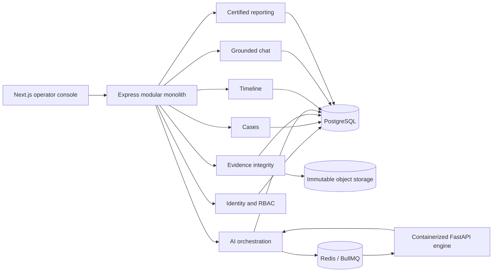

# CrimeVision AI architecture

## Architectural style

CrimeVision AI is a modular monolith: one deployable Node.js backend owns the transactional boundary, while each business capability is isolated behind a module-local service and repository. The Python process is an inference boundary, not an independently owned business service. It cannot write to the case database.

## Module contracts

| Module | Responsibility | Owns |
| --- | --- | --- |
| Auth | Establish actor identity and enforce roles | Request actor context |
| Cases | Case lifecycle and access-scoped retrieval | `Case` |
| Evidence | Upload, hashing, storage keys, integrity checks | `Evidence` |
| Analysis | Queueing and normalization of inference output | `AIResult` |
| Timeline | Chronological read model over case results | No writes |
| Chat | Evidence-grounded retrieval and answers | Audit event only |
| Reporting | Cryptographically bound export manifests | Audit event only |
| Audit | Append-only chain-of-custody history | `AuditLog` |

Modules never import another module's route. Cross-module collaboration happens through services or narrow repositories. Infrastructure is kept under `src/infrastructure`; HTTP-only concerns live in route files.

## Security and evidentiary controls

- Production refuses to boot with development authentication.
- Clerk JWT validation occurs before all `/api/v1` routes.
- Every evidence mutation, integrity check, query, and export creates an audit event.
- Original uploads are stored under a raw storage namespace and addressed by an opaque storage key.
- SHA-256 is computed by streaming the committed object; the integrity endpoint recomputes it from storage.
- Zod rejects unexpected or malformed API inputs.
- Upload type and byte limits are enforced before business processing.
- Authorization headers and cookies are redacted from request logs.
- Chat answers are based only on indexed `AIResult` payloads and explicitly decline unsupported conclusions.

## AI adapter boundary

The included deterministic model adapter proves the orchestration contract without downloading unvalidated model weights. It labels every result as demo output. Production deployments must replace the adapters with validated YOLO, PaddleOCR, Whisper, tracking, and reconstruction implementations, pin model artifacts by checksum, and execute the accuracy and bias validation plan before evidentiary use.
